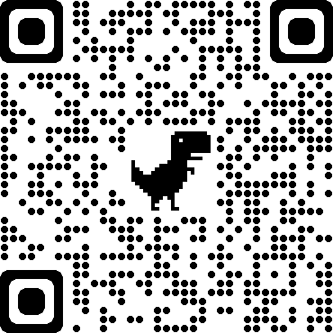

## DeepLinking POC

### Demo: <a href='https://dlpoc.netlify.app'>dlpoc.netlify.app</a>

A dynamic url that redirects a user to download the YouTube App from the correct platform based on the user's device or browser userAgent.

Similar to https://www.onelink.to/

### Or scan QR

